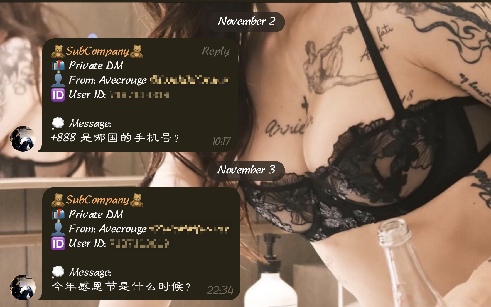

# TgRentalBot – Docker Deployment Pack

This pack contains production-ready files to run TgRentalBot with Docker on any VPS/VM or **your server(s)**.

**Included**

- `Dockerfile`
- `docker-compose.yml`
- `.env.example`
- `.dockerignore`

> The bot uses long polling, so no inbound port is required. Use an outbound proxy only if your region blocks Telegram (mainland China, etc.).

## Shortcuts

Example for my Bot: [🧸SubCompany🧸](https://t.me/avecsubot)




## Prerequisites

- Docker Engine & Docker Compose v2
- Project root contains `main.py` and `requirements.txt` aligned with:
  ```
  python-telegram-bot>=20.7,<21
  openai>=1.40.0,<2
  ```

## Quick Start
1) Copy these files into the repository root.
   ```bash
   # example
   cd /opt
   # clone repo
   git clone https://github.com/Sifortonzh/TgRentalBot.git
   ```
2) Create `.env` from the template and fill `TELEGRAM_BOT_TOKEN`, `FORWARD_TO` (numeric), and optionally `OPENAI_API_KEY`.
3) Build & run:
   ```bash
   docker compose build --no-cache
   docker compose up -d
   docker compose logs -f --tail=100
   ```

## Proxy (only if outbound to Telegram is blocked)
In `.env`:
```
HTTP_PROXY=http://127.0.0.1:7890
HTTPS_PROXY=http://127.0.0.1:7890
```
Validate:
```
docker exec -it tgrentalbot curl -I https://api.telegram.org
```

## Common Ops
```
docker compose restart
docker compose logs -f --tail=200
git pull && docker compose build --no-cache && docker compose up -d
```

## Troubleshooting
- 401 Unauthorized → wrong BOT_TOKEN
- Missing envs → fix `.env`
- Network timeouts → set proxy
- PTB version errors → ensure v20+ API (ApplicationBuilder + run_polling)